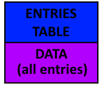

ALL
===

This type of file contains icons.

.. note::

   Byte ordering is little endian

File format
-----------

Header
^^^^^^

There is no header, it's directly the entry table.

.. code-block:: text

    +0x00          EntryTable

Entries Table
^^^^^^^^^^^^^

.. code-block:: text

    +0x00           Offset              [DWORD]
    +0x04           Length              [DWORD]         // Must a multiple of 4

Entry
"""""

.. code-block:: text

    +0x00 :     IMG_TYPE        [WORD]
    +0x02 :     UNK_WORD_00     [WORD]
    +0x04 :     HEIGHT          [WORD]
    +0x06 :     WIDTH           [WORD]
    +0x0A :     DATA            [BYTE] * (Length - 0x08)

If :class:`IMG_TYPE` is equal to 0x03 then the data are encoded using :ref:`RLE <rle-label>`.

The data are raw 8 bit palletized image.

Example
^^^^^^^

The file :file:`ICONS.ALL` is from the DEMO version.

.. code-block:: text

    > md5sum ICONS.ALL
    91c4c33339cc0661be9568d79ead8911  ICONS.ALL
    > hexdump -C -n 100 ICONS.ALL
    00000000  d0 03 00 00 66 00 00 00  38 04 00 00 53 01 00 00  |....f...8...S...|
    00000010  8c 05 00 00 f0 1a 00 00  7c 20 00 00 1d 01 00 00  |........| ......|
    00000020  9c 21 00 00 cb 01 00 00  68 23 00 00 06 01 00 00  |.!......h#......|
    00000030  70 24 00 00 f4 00 00 00  64 25 00 00 0c 01 00 00  |p$......d%......|
    00000040  70 26 00 00 01 01 00 00  74 27 00 00 23 01 00 00  |p&......t'..#...|
    00000050  98 28 00 00 e5 00 00 00  80 29 00 00 01 01 00 00  |.(.......)......|
    00000060  84 2a 00 00                                       |.*..|

Entry 00:

* Offset : 0x000003D0 (976)
* Length : 0x00000066 (102)

.. code-block:: text

    > hexdump -C -n 100 -s 976 ICONS.ALL
    000003d0  03 00 01 01 0a 00 0e 00  f2 01 f8 00 01 73 01 f7  |.............s..|
    000003e0  00 01 64 73 01 f6 00 01  64 62 73 01 f5 00 01 64  |..ds....dbs....d|
    000003f0  f2 62 73 01 f4 00 01 64  f3 62 73 01 f3 00 01 64  |.bs....d.bs....d|
    00000400  f4 62 73 01 f2 00 01 64  62 f3 64 62 73 01 00 01  |.bs....db.dbs...|
    00000410  f2 64 71 73 71 64 62 73  01 00 f8 01 00 f4 00 01  |.dqsqdbs........|
    00000420  71 01 f3 00 f5 00 f3 01  f2 00 f5 00 01 62 01 f2  |q............b..|
    00000430  00 f6 00 01                                       |....|
    
* IMG_TYPE = 0x0003
* UNK_WORD_00 = 0x0101
* HEIGHT = 0x000A (10)
* WIDTH = 0x000E (14)

Entry 0x78:

.. code-block:: python

    import all_parser
    allf = all_parser.AllF("D:\Game\Realms of the Haunting\DATA\DATA\ICONS.ALL")
    pixels = allf.extract_index(0x78)
    print all_parser.hexdump(pixels, 26)

.. code-block:: text

    0000  76 76 00 00 00 00 00 00 00 00 00 00 00 00 00 00 00 00 00 00 00 00 00 00 00 00   vv........................
    001a  76 20 76 76 76 00 00 00 00 00 00 00 00 00 00 00 00 00 00 00 00 00 00 00 00 00   v vvv.....................
    0034  78 76 20 ec 0c 76 76 76 76 00 00 00 00 00 00 00 00 00 00 00 00 00 00 00 00 00   xv ..vvvv.................
    004e  78 76 ec 20 21 0c 0c d6 22 76 00 00 00 00 00 00 00 00 00 00 00 00 00 00 00 00   xv. !..."v................
    0068  00 76 0c 21 ec 0c d6 76 76 00 00 00 00 00 00 00 00 00 00 00 00 00 00 00 00 00   .v.!...vv.................
    0082  00 78 76 0c 0c ec 0c d6 76 00 00 00 00 00 00 00 00 00 00 00 00 00 00 00 00 00   .xv.....v.................
    009c  00 78 76 0c d6 0c 8a 22 d6 76 00 00 00 00 00 00 00 00 00 00 00 00 00 00 00 00   .xv....".v................
    00b6  00 00 76 d6 76 22 22 8a 22 d6 76 00 00 00 00 00 00 00 00 00 00 00 00 00 00 00   ..v.v"".".v...............
    00d0  00 00 76 22 76 76 22 22 8a 22 d6 76 76 76 76 00 00 00 00 00 00 00 00 00 00 00   ..v"vv"".".vvvv...........
    00ea  00 00 78 76 78 78 76 22 22 8a 21 21 21 ec 21 76 76 00 00 00 00 00 00 00 00 00   ..xvxxv"".!!!.!vv.........
    0104  00 00 00 78 00 00 78 76 22 21 d6 ec 76 76 76 ec d6 76 00 00 00 00 00 00 00 00   ...x..xv"!..vvv..v........
    011e  00 00 00 00 00 00 00 78 76 d6 21 76 67 f6 67 76 21 76 00 00 00 00 00 00 00 00   .......xv.!vg.gv!v........
    0138  00 00 00 00 00 00 00 00 76 d6 b0 67 f6 fa 7d 68 b0 22 76 00 00 00 00 00 00 00   ........v..g..}h."v.......
    0152  00 00 00 00 00 00 00 00 76 22 a2 68 7d fa f6 67 a2 22 d2 76 76 00 00 00 00 00   ........v".h}..g.".vv.....
    016c  00 00 00 00 00 00 00 00 76 22 0c d2 67 f6 67 d2 0c 22 21 21 d6 76 76 00 00 00   ........v"..g.g.."!!.vv...
    0186  00 00 00 00 00 00 00 00 78 76 d6 ec d2 d2 d2 ec d2 d2 76 76 76 d6 d6 76 00 00   ........xv........vvv..v..
    01a0  00 00 00 00 00 00 00 00 00 76 22 d6 21 ec 21 d6 76 76 47 47 47 76 76 d6 76 00   .........v".!.!.vvGGGvv.v.
    01ba  00 00 00 00 00 00 00 00 00 78 76 76 22 22 21 76 e2 47 44 44 44 47 e2 76 22 76   .........xvv""!v.GDDDG.v"v
    01d4  00 00 00 00 00 00 00 00 00 00 78 78 76 22 21 76 47 44 de c9 40 44 47 76 22 76   ..........xxv"!vGD..@DGv"v
    01ee  00 00 00 00 00 00 00 00 00 00 00 00 78 76 0c 76 47 44 c9 b3 c9 44 47 76 d6 76   ............xv.vGD...DGv.v
    0208  00 00 00 00 00 00 00 00 00 00 00 00 00 76 d6 b2 63 44 de e6 de 44 63 76 d6 76   .............v..cD...Dcv.v
    0222  00 00 00 00 00 00 00 00 00 00 00 00 00 76 22 21 be 63 46 44 46 63 be d6 d4 78   .............v"!.cFDFc...x
    023c  00 00 00 00 00 00 00 00 00 00 00 00 00 78 b0 d6 21 be 63 63 63 be 21 d6 b0 78   .............x..!.ccc.!..x
    0256  00 00 00 00 00 00 00 00 00 00 00 00 00 00 76 22 d6 21 21 ec 21 21 d6 22 76 00   ..............v".!!.!!."v.
    0270  00 00 00 00 00 00 00 00 00 00 00 00 00 00 78 76 76 d4 d6 21 d6 d6 b0 76 78 00   ..............xvv..!...vx.
    028a  00 00 00 00 00 00 00 00 00 00 00 00 00 00 00 78 78 76 76 76 76 76 78 78 00 00   ...............xxvvvvvxx..
    02a4  00 00 00 00 00 00 00 00 00 00 00 00 00 00 00 00 00 78 78 78 78 78 00 00 00 00   .................xxxxx....