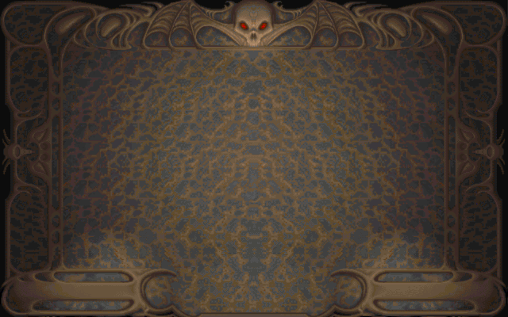

RAW
===

There is two types of RAW file:

1) The one stored in the folder :file:`DATA/` and named :file:`BACKDROP.RAW`
2) Other stored in the folder :file:`M/` (:file:`DAUSO1EA.RAW`, :file:`DSTUDY1.RAW`, ...)

DATA/*.RAW
----------

Header
^^^^^^

.. code-block:: text

    +0x00 :     IMG_TYPE        [DWORD]
    +0x04 :     WIDTH           [WORD]
    +0x06 :     HEIGHT          [WORD]
    +0x08 :     DATA            [BYTE] * (FILESIZE - 8)

Data
^^^^

If :class:`IMG_TYPE` is equal to 0x03 then the data are encoded using :ref:`RLE <rle-label>`.

The data are raw 8 bit palletized image.

Example
^^^^^^^

The file :file:`BACKDROP.RAW` is from the DEMO version.

.. code-block:: text

    > md5sum BACKDROP.RAW
    2c9debcf210c1bfa089c5dbfae7d2f40 BACKDROP.RAW
    > hexdump -n 8 -C BACKDROP.RAW
    00000000  03 00 00 00 80 02 90 01                           |........|
    00000008

Header information:

.. code-block:: text

    [+] flag         = 0x00000003       // TYPE RLE
    [+] width        = 0x0280 (640)
    [+] height       = 0x0190 (400)

Data:

.. code-block:: text

    > hexdump -s 8 -C BACKDROP.RAW | head -3
    00000008  ff 4e ff 4e 4e fe 78 ff  4d ff 4d ff 4d 4d 78 4e  |.N.NN.x.M.M.MMxN|
    00000018  78 ff 4e ff 4e ff 4e ff  4e ff 4e ff 4e ff 4e ff  |x.N.N.N.N.N.N.N.|
    00000028  4e fb 4e f2 78 b3 c4 f2  0a f4 08 f3 76 f2 bc 76  |N.N.x.......v..v|

RLE result:

.. code-block:: text

    0000  4e 4e 4e 4e 4e 4e 4e 4e 4e 4e 4e 4e 4e 4e 4e 4e   NNNNNNNNNNNNNNNN
    0010  4e 4e 4e 4e 4e 4e 4e 4e 4e 4e 4e 4e 4e 4e 4e 78   NNNNNNNNNNNNNNNx
    0020  78 78 78 78 78 78 78 78 78 78 78 78 78 4d 4d 4d   xxxxxxxxxxxxxMMM
    0030  4d 4d 4d 4d 4d 4d 4d 4d 4d 4d 4d 4d 4d 4d 4d 4d   MMMMMMMMMMMMMMMM

Image result:
    

    
.. note::

    Palette used is the one from :ref:`HERE <HERE-label>`

M/*.RAW
-------