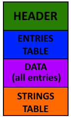

SFX
===

This type of file contains sound effects.

.. note::

   Byte ordering is little endian

File format
-----------

Header
^^^^^^

.. code-block:: text

    +0x00          Signature           [DWORD]
    +0x04          Version             [DWORD]
    +0x08          OffsetEntriesTable  [DWORD]
    +0x0C          TotalLengthData     [DWORD]
    +0x10          LengthEntriesTable  [DWORD]
    +0x14          OffsetStringTable   [DWORD]
    +0x18          LengthStringTable   [DWORD]
    +0x1C          EntryTable          [BYTE] * (LengthEntryTable / 0x0C)
    +0xXX          Data                [BYTE] * TotalLengthData
    +0xXX          StringTable         [BYTE] * (LengthStringTable / 0x0C)

Entries Table
^^^^^^^^^^^^^

.. code-block:: text

    +0x00           Offset              [DWORD]
    +0x04           Length              [DWORD]
    +0x08           UNK_WORD_00         [WORD]          // Id?
    +0x0A           UNK_BYTE_00         [BYTE]          // Flag?
    +0x0B           UNK_BYTE_01         [BYTE]

Entry
"""""

Data are 16-bit samples with single channel (mono) and with a sampling rate of 11025Hz.

Python example for convertion:

.. code-block:: python
    :caption: SFX entry data convert example

    import wave
    wave_output = wave.open("out.wav", "wb")
    wave_output.setparams((1, 2, 11025, 0, "NONE", "not compressed"))
    for i in xrange(0, len(audio_data), 2):
        # Write audio frames and make sure nframes is correct.
        wave_output.writeframes(audio_data[i:i + 2])
    wave_output.close()

String Table
^^^^^^^^^^^^

.. code-block:: text

    +0x00           ID                  [WORD]
    +0x02           Name                [CString]
    +0x06           Description         [CString]

Example
-------

.. note::

    TODO